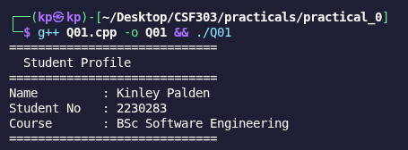
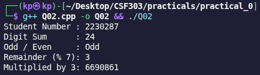
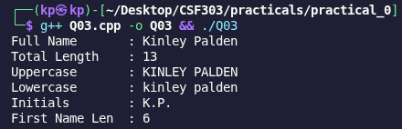
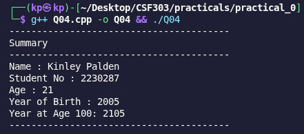
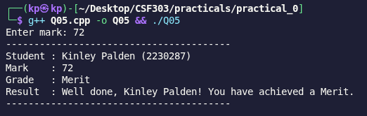
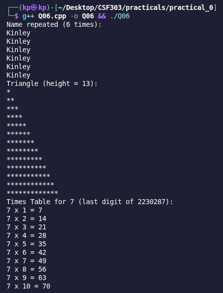
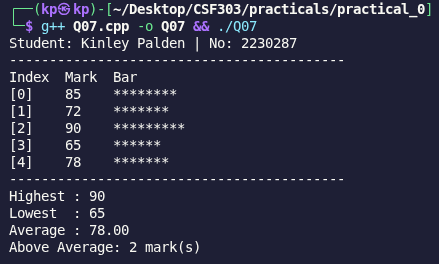
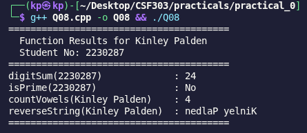
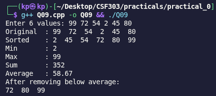
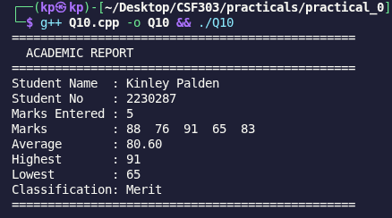

# CSF303 C++ Programming Practicals - Practical 0

**Kinley Palden** | 2230287  
BSc Software Engineering | March 4, 2026

---

## Overview

Just finished all 10 practicals! This covers everything from basic output to building actual classes—printing text, playing with strings, conditional logic, loops, arrays, functions, vectors, and finally diving into OOP.

---

## Q01: Personal Introduction Output

Basic warmup just print out my info using `cout` and string variables. Nothing fancy, but good to get the syntax right.



---

## Q02: Arithmetic with Student Number

Took my student number and did various calculations—digit sum, odd/even check, modulo operations. Used while loops to extract digits digit by digit.



---

## Q03: String Manipulation & Analysis

Played with string functions—calculating length, converting to uppercase/lowercase, finding initials. Pretty useful stuff for understanding how C++ handles strings.



---

## Q04: User Input & Type Conversion

First time taking user input with `cin`. Asked for age, then calculated birth year and when I'd turn 100. Simple math but good practice.



---

## Q05: Conditional Grade Classification

Built a grade classifier with if-else chains. Input validation makes sure marks are 0-100, then it outputs your grade and a personalized message.



---

## Q06: Loop-Based Pattern Generation

Fun one—printing patterns with loops. Name repetition, asterisk triangle, and a multiplication table. Nested loops are key here.



---

## Q07: Array Operations & Statistics

First time working with arrays. Stored some marks and calculated min, max, average. Used loops to find stats and made a visual bar chart with asterisks.



---

## Q08: Function Design & Modular Programming

Wrote several helper functions: digit sum, prime checker, vowel counter, and string reversal. Good intro to breaking code into reusable pieces.



---

## Q09: Vector & Dynamic Collections

Used STL vectors for the first time. Takes user input, sorts it, finds min/max, and filters out values below the average using `remove_if` and lambda functions.



---

## Q10: Classes & Object-Oriented Design

Final one—built a `Student` class with private attributes, a constructor, and methods for adding marks, calculating stats, and grading. This is where it all comes together.



---

## Quick Recap

Covered all the essentials: variables, I/O, strings, conditionals, loops, arrays, functions, vectors, and classes. Each practical builds on the last, so by Q10 you're actually writing real code.

## How to Compile

```bash
g++ Q0X.cpp -o Q0X && ./Q0X
```

Done!
