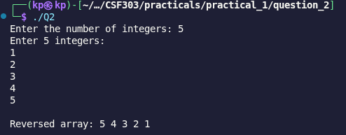

# Problem 2: Reverse the Array

## Problem Summary

Given N integers, read them into a vector and print the array in reverse order using reverse traversal.

## Algorithm Explanation

1. Read N integers into a vector
2. Iterate from index n-1 down to 0 (reverse direction)
3. Print each element during the traversal
4. This approach avoids creating a copy of the array

The algorithm uses in-place reverse traversal without modifying the original array.

## Time Complexity Analysis

- **Reading input:** O(n)
- **Reverse traversal and printing:** O(n) - single pass through array in reverse
- **Overall Time Complexity:** O(n)

No sorting or complex operations - just a single pass in reverse order.

## Space Complexity Analysis

- **Vector storage:** O(n) - stores all N integers
- **Other variables:** O(1) - loop counter and indices use constant space
- **Overall Space Complexity:** O(n)

## Reflection

This problem demonstrates that reverse printing can be done efficiently with a single reverse traversal without needing to modify or copy the array. Key learnings:

- Simple iteration controls (decrement loop) are sufficient for reversal
- No need for the `reverse()` function if only printing is required
- Reverse traversal is intuitive and space-efficient
- Time complexity is optimal (O(n)) as we must visit each element at least once

## Screenshots

