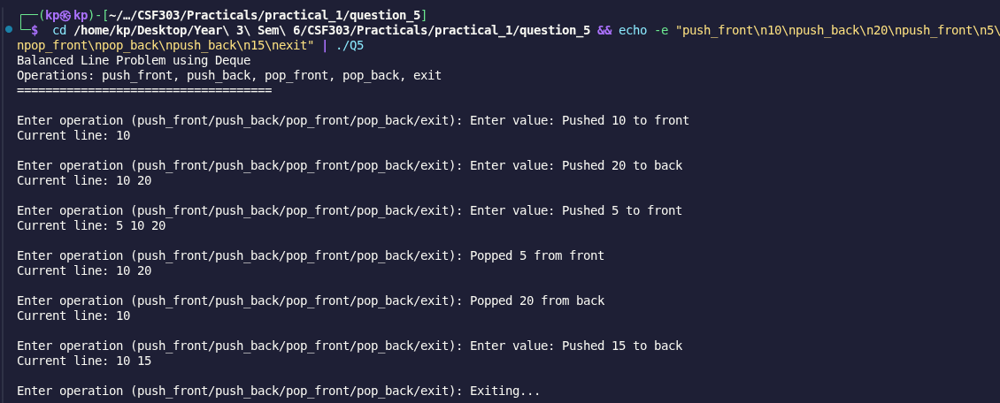

# Problem 5: Balanced Line Problem

## Problem Summary

Simulate a real-world queue/line where people can enter from front or back, and leave from either end. Support operations: push_front, push_back, pop_front, pop_back, and display the line after each operation.

## Algorithm Explanation

1. Use a **deque<int>** to represent the line of people
2. For each operation:
   - **push_front(x):** Add person to the front of the line
   - **push_back(x):** Add person to the back of the line
   - **pop_front():** Remove person from the front
   - **pop_back():** Remove person from the back
   - Check for empty deque before popping
3. After each operation, print the current contents of the deque
4. Continue until user enters "exit"

The deque is perfect for this problem with O(1) operations at both ends.

## Time Complexity Analysis

- **push_front/push_back:** O(1) - constant time insertion at either end
- **pop_front/pop_back:** O(1) - constant time removal at either end
- **Printing the line:** O(n) - where n is current number of people in line
- **Per operation:** O(n) for printing, O(1) for queue operation

## Space Complexity Analysis

- **Deque storage:** O(n) - stores up to n people in the line
- **Other variables:** O(1) - string operations and indices
- **Overall Space Complexity:** O(n)

## Reflection

This practical problem demonstrated real-world applications of deques. Key learnings:

- Deques are superior to vectors for this use case because both push_front and pop_front are O(1)
- Without deque, push_front on a vector would be O(n) due to shifting elements
- Interactive input handling makes the program more user-friendly
- Empty check before popping prevents segmentation faults
- Deques are perfect for simulating real queue/stack scenarios with both ends accessible

## Screenshots

