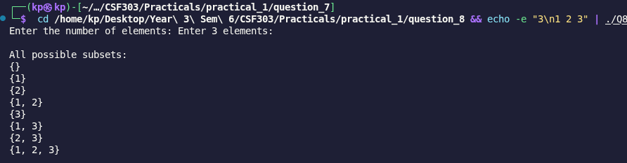

# Problem 8: Subset Generation

## Problem Summary

Given a set of N numbers, generate and print all possible 2^N subsets using the bitmask technique.

## Algorithm Explanation

1. Read N elements into a vector
2. Calculate total subsets = 2^N (using bit shift: `1 << n`)
3. For each mask from 0 to 2^N - 1:
   - For each bit position i from 0 to n-1:
     - Check if i-th bit is set in mask using `(mask & (1 << i))`
     - If set, include arr[i] in the current subset
   - Print the subset with proper formatting
4. Each mask value uniquely represents a subset

The bitmask technique maps each integer to a unique subset through its binary representation.

## Time Complexity Analysis

- **Reading input:** O(n)
- **Generating all subsets:** O(n × 2^n)
  - 2^n subsets to generate
  - For each subset, we check n bit positions: O(n)
- **Printing:** O(n × 2^n)
- **Overall Time Complexity:** O(n × 2^n)

This is optimal because there are 2^n subsets and we must output each one.

## Space Complexity Analysis

- **Vector storage:** O(n) - stores all N integers
- **Output space:** O(2^n) - if we count the printed subsets
- **Other variables:** O(1) - mask, counters
- **Overall Space Complexity:** O(n) if not counting output

## Reflection

This problem brilliantly demonstrated the power of bitmask techniques in combinatorics. Key learnings:

- Bitmask approach is cleaner than recursive backtracking for generating subsets
- Each number from 0 to 2^n - 1 has a unique binary representation
- Bit manipulation (specifically & and <<) is efficient and elegant
- The approach is non-recursive, avoiding function call overhead
- This technique extends to other subset problems with constraints
- Initially seemed complex but very intuitive once understood: bit i set = element i included

## Screenshots

