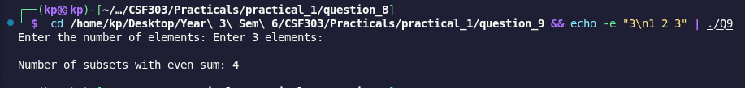

# Problem 9: Count Subsets with Even Sum

## Problem Summary

Given N numbers, count how many of the 2^N possible subsets have a sum that is even.

## Algorithm Explanation

1. Read N elements into a vector
2. Calculate total subsets = 2^N (using bit shift: `1 << n`)
3. For each mask from 0 to 2^N - 1:
   - Initialize sum = 0
   - For each bit position i from 0 to n-1:
     - If i-th bit is set in mask: add arr[i] to sum
   - Check if sum is even: `sum % 2 == 0`
   - If even, increment the counter
4. Print the total count of subsets with even sum

The algorithm extends subset generation by adding a constraint check (even sum).

## Time Complexity Analysis

- **Reading input:** O(n)
- **Generating and checking all subsets:** O(n × 2^n)
  - 2^n subsets to generate
  - For each subset, we sum n elements: O(n)
- **Modulo check:** O(1) per subset
- **Overall Time Complexity:** O(n × 2^n)

## Space Complexity Analysis

- **Vector storage:** O(n) - stores all N integers
- **Counter and sum variables:** O(1)
- **Overall Space Complexity:** O(n)

## Reflection

This problem reinforced bitmask generation while adding a filtering constraint. Key learnings:

- The even/odd check is trivial (modulo 2), making the problem straightforward
- Pattern observation: For any set, exactly half of all subsets have even sum
  - This is because flipping any odd element in/out changes parity
  - So answer = 2^(n-1) for any set with at least one odd element
- Understanding this pattern could optimize to O(1), but the bitmask approach is more general
- This technique applies to various subset problems: sum constraints, product constraints, etc.
- The combination of bitmask subset generation + constraint checking is powerful for many problems

## Screenshots

